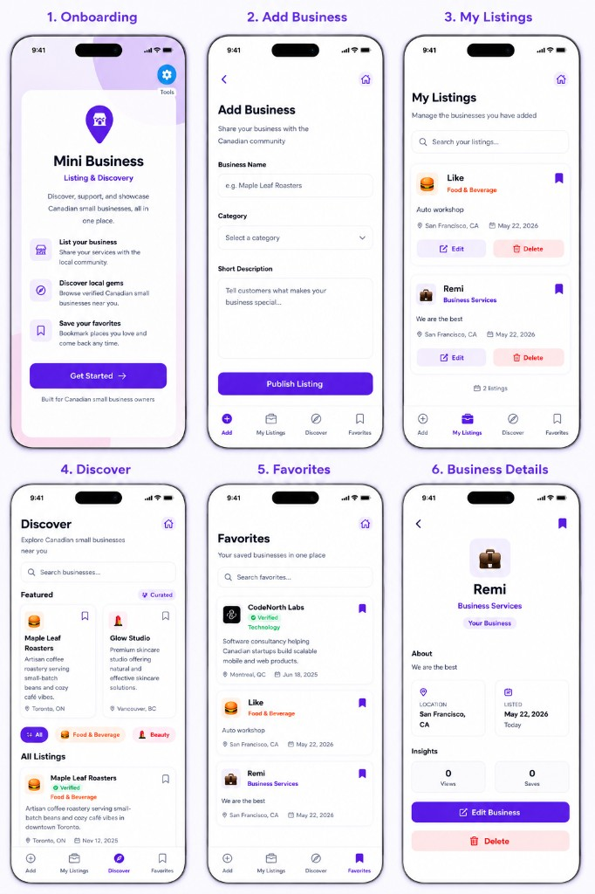

# Mini Business Listing & Discovery

A polished cross-platform mobile and web app for Canadian small business owners to list, browse, and discover local businesses.

Built with **Expo + React Native + React Native Web + TypeScript** — a single shared codebase that runs natively on iOS, Android, and the web.

> **Status:** All required scope delivered, plus optional features and product-led polish beyond the MVP. See the [Assessment Requirements Checklist](#assessment-requirements-checklist) below.

---

## Live Demo

| Platform | Link |
| --- | --- |
| Web | **[mini-business-listing-discovery.vercel.app](https://mini-business-listing-discovery.vercel.app/)** — open in any browser |
| iOS (TestFlight) | _(TestFlight invite link goes here once Apple approves the build)_ |
| Android (APK) | [Download installable APK](https://expo.dev/accounts/abosedekikelomo408/projects/mini-business-listing/builds/a7286643-59ff-4629-ae99-e82696da5613) — open on an Android device |

> Local development works out of the box — see [Getting Started](#getting-started).

---

## Assessment Requirements Checklist

The original brief was a strict 3–4 hour MVP. Every required item is delivered, and a number of optional / "nice to have" items are too — clearly flagged below so it's obvious what was scope vs. extra.

### ✅ Required scope

| Requirement | Where it lives |
| --- | --- |
| **Create a Business Listing** — Name, Category, Short Description | `src/screens/AddBusinessScreen.tsx` + `src/components/BusinessForm.tsx` |
| **View All Listings** — vertically scrollable list with name / category / description | `src/screens/AllListingsScreen.tsx` + `src/components/BusinessCard.tsx` |
| **Search** (optional) — filter by business name with "No results" state | `src/components/SearchBar.tsx`, used in All Listings, My Listings, Favorites |
| **Data Handling** — local persistence | `src/storage/businessStorage.ts` via `AsyncStorage` |
| **README** — how to run, decisions, trade-offs, v2 ideas | This file |

### ✨ Beyond the brief (product-led polish)

These were not required but were added to demonstrate product thinking, UX care, and clean architecture under time pressure.

- **My Listings** screen separating "your businesses" from the community feed
- **Business Details** screen with verification badges and mock analytics (views, saves, trending)
- **Favorites** with `AsyncStorage` persistence and a dedicated screen
- **Edit / Delete** with a confirmation modal — only allowed on listings you own
- **Featured section** on the discover feed
- **Category system** with seven categories, emoji icons, and accent colors
- **Auto-location** via `expo-location` on Add, with a clean fallback to "Location unavailable"
- **Pull-to-refresh** and **skeleton loaders** on list screens
- **Empty states** for empty lists and zero-search-results
- **Light / Dark mode** with system-based default and manual toggle
- **Splash + onboarding** flow with a branded purple splash and a "Home / Get Started" screen
- **Responsive web layout** — mobile-app-style at narrow widths, sidebar navigation on wide desktops
- **Custom branded icons / splash** rendered consistently across iOS, Android, and the web

If you only want to evaluate against the minimum brief, the required surface is `Add Business → All Listings → Search`. Everything else is bonus.

---

## Screenshots

<p align="center">
  
</p>

---

## Getting Started

### Prerequisites

- Node.js 18+
- npm
- Expo Go on a physical device, **or** an iOS Simulator / Android Emulator
- A modern browser for the web build

### Install

```bash
npm install
```

### Run on iOS

```bash
npm run ios
```

Opens the iOS Simulator. You can also scan the QR code with Expo Go on a physical iPhone.

### Run on Android

```bash
npm run android
```

Opens the Android Emulator. You can also scan the QR code with Expo Go on a physical Android device.

### Run on Web

```bash
npm run web
```

Opens in your browser. The layout is mobile-first at narrow viewports and expands into a sidebar layout at ≥1024px.

### Build the production web bundle

```bash
npm run build:web
```

Outputs static files to `dist/` — what Vercel deploys.

---

## Architecture & Decisions

### Single shared codebase

Expo + React Native + React Native Web means iOS, Android, and the web share the same components, screens, navigation, and business logic. No duplicated UI for different platforms.

### State management — Context API

`BusinessContext` exposes a single surface of actions, no Redux:

- `addBusiness`
- `editBusiness`
- `deleteBusiness`
- `favoriteBusiness`
- `searchBusiness`
- `loadBusinesses`

`ThemeContext` handles light / dark mode separately so theming concerns stay isolated from business data.

### Navigation

- **Bottom tabs:** Add Business, My Listings, All Listings (Discover), Favorites
- **Stack screens:** Home, Splash, Business Details, Edit Business

React Navigation gives native-feeling transitions on mobile and routes cleanly on the web.

### Data layout

- Mock community businesses ship in `src/data/mockBusinesses.ts` to make the feed feel real on first launch
- User-created businesses persist locally with `owner: "me"`
- Favorites persist as an array of business IDs and are re-applied on launch

### Responsive web

A small `useResponsive` hook detects wide web viewports. On mobile / narrow web the app is centered at 430px max-width so it still feels like a mobile app. On wide web the tab bar moves to a sidebar and content expands to 720px — a deliberate desktop layout, not a stretched mobile UI.

---

## Why AsyncStorage?

> "I chose AsyncStorage because the assessment explicitly stated that a backend API was not expected, and AsyncStorage provides lightweight local persistence suitable for a cross-platform mobile MVP."

It's the smallest possible piece of infrastructure that satisfies the spec — no schemas, no migrations, no server. It also works identically on iOS, Android, and the web (via `localStorage` under the hood), so a single persistence layer covers all three platforms.

Businesses and favorites are loaded on app launch and saved after every mutation, so users get a consistent experience across sessions with zero server infrastructure.

---

## Trade-offs (intentional, due to time)

| Decision | Trade-off |
| --- | --- |
| No backend | Data is device-local; no sync across devices or users |
| Mock community listings | Static seed data instead of real marketplace content |
| Local favorites | Bookmark state doesn't update the mock analytics counters |
| Location on web | Browser geolocation may be limited; falls back to "Location unavailable" |
| Single user (`owner: "me"`) | No multi-account auth — sufficient for the MVP demo flows |
| Category list is hard-coded | Avoided building category management UI to stay focused |

---

## v2 — what I'd build next

- Real backend (e.g. Postgres + a thin Node/Express or Hono API) with auth and multi-user listings
- Cloud sync for favorites and businesses across devices
- Map-based discovery with distance sorting from the device's location
- Photo uploads + business hours + contact info
- Push notifications for trending or newly verified listings
- Admin verification workflow with a real review queue
- Pagination / infinite scroll once the catalog grows
- Shared favorites and lightweight social features

---

## EAS Build (iOS + Android)

The project is configured for [EAS Build](https://docs.expo.dev/build/introduction/).

```bash
# Login once
eas login

# Build profiles
eas build --platform ios --profile production    # store-ready IPA
eas build --platform android --profile preview   # standalone APK
eas build --platform android --profile production
```

### Profiles

- **development** — Dev client for internal testing
- **preview** — APK for Android internal distribution
- **production** — Store-ready builds with auto-incrementing version

Web is deployed separately via Vercel (`vercel.json` in the root).

---

## Project Structure

```
src/
  components/     Reusable UI (cards, search, modals, featured, pickers, brand)
  context/        BusinessContext + ThemeContext
  data/           Mock businesses and categories
  navigation/     Tab + stack navigators, sidebar for web
  screens/        Home, Splash, Add, My Listings, All Listings, Details, Edit, Favorites
  storage/        AsyncStorage helpers
  theme/          Colors, spacing, typography
  types/          TypeScript models
  utils/          Date formatting, location, responsive helpers
```

---

## Tech Stack

- Expo SDK 56
- React Native 0.85
- React Native Web
- TypeScript
- React Navigation (bottom tabs + native stack)
- Context API
- AsyncStorage
- expo-location
- @expo/vector-icons

---

## License

Private — built for a technical assessment.
